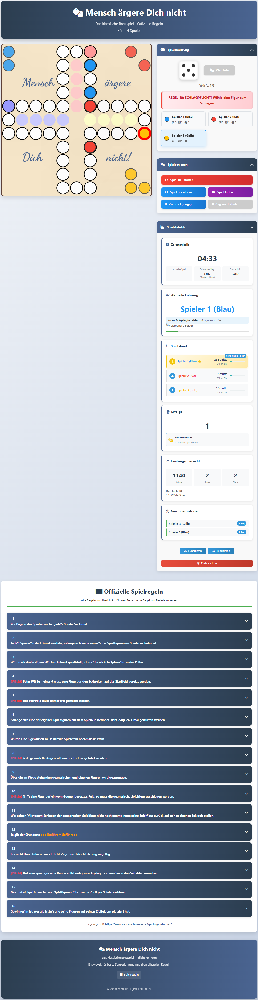

# 🎲 Mensch ärgere Dich nicht – Extended-Edition

## 📑 Inhaltsverzeichnis

* [Projektübersicht](#-projektübersicht)
* [Warum dieses Projekt?](#-warum-dieses-projekt)
* [Danksagung](#-danksagung)
* [Hauptfunktionen](#-hauptfunktionen)

  * [Kernspielmechanik](#-kernspielmechanik)
  * [Datenpersistenz](#-datenpersistenz)
  * [Benutzererfahrung (UX)](#-benutzererfahrung-ux)
  * [Technische Features](#-technische-features)
* [Technologie-Stack](#-technologie-stack)
* [Projektstruktur](#-projektstruktur)
* [Besondere Implementierungsdetails](#-besondere-implementierungsdetails)
* [Installation & Ausführung](#-installation--ausführung)
* [Code-Qualität & Best Practices](#-code-qualität--best-practices)
* [Herausforderungen & Lösungen](#-herausforderungen--lösungen)
* [Mögliche Erweiterungen](#-mögliche-erweiterungen)
* [Screenshot](#-screenshot)
* [Lizenz](#-lizenz)
* [Feedback & Beiträge](#-feedback--beiträge)

---

## 📋 Projektübersicht

Eine vollständige digitale Implementierung des klassischen deutschen Brettspiels „Mensch ärgere Dich nicht“ mit allen offiziellen Turnierregeln.
Das Projekt demonstriert fortgeschrittene Frontend-Entwicklung mit besonderem Fokus auf Spielmechanik, UX-Design und State-Management – komplett ohne externe Abhängigkeiten.

## 🧲 Warum dieses Projekt?

* Dieses Projekt wurde bewusst als komplexes, regelgetriebenes Browser-Spiel umgesetzt, um reale Herausforderungen moderner Frontend-Entwicklung praxisnah abzubilden:

* Komplexe Business-Logik: Umsetzung und Validierung eines umfangreichen Regelwerks

* State-Management ohne Frameworks: Saubere Trennung von Spielzustand, UI und Persistenz

* UX-Fokus: Intuitive Bedienung trotz hoher funktionaler Komplexität

* Performance & Wartbarkeit: Effiziente DOM-Updates und modulare Architektur

* Das Ergebnis ist kein Demo-Projekt, sondern eine vollwertige Anwendung, die Architekturentscheidungen, Code-Qualität und Produktdenken sichtbar macht.

## 🙏 Danksagung

* Regelquelle: **ASTA Uni Bremen**
* Inspiration: Klassisches Brettspiel von *Josef Friedrich Schmidt (1914)*
* Icons: Font Awesome 6.4.0
* Schriftart: Google Fonts – *Dancing Script*

---

## 🚀 Hauptfunktionen

### 🎮 Kernspielmechanik

* ✅ Vollständige Implementierung aller **16 offiziellen Turnierregeln**
* ✅ **2–4 Spieler-Modus** mit dynamischer Spielfeldanpassung
* ✅ **3D-Würfelsimulation** mit realistischer Physik-Animation
* ✅ Automatische Regelprüfung (Schlagpflicht, Startpflicht, Zugpflicht)
* ✅ Erweiterte Spielsteuerung mit **Undo/Redo-Funktion**

### 💾 Datenpersistenz

* 🔄 Automatische Spielstandspeicherung in **5 Slots**
* 📊 Detaillierte Statistiken pro Spieler und global
* ⏱️ Echtzeit-Spielzeit-Tracking mit Leaderboard
* 📈 Historische Gewinnerdaten mit Rangliste

### 🎨 Benutzererfahrung (UX)

* 📱 Vollständig **responsive** für Desktop, Tablet und Smartphone
* 🎯 Intuitive Bedienung mit visuellen Hilfen
* 🔍 Interaktive Regelanzeige (Akkordeon-System)
* 🎨 Visuelles Feedback (z. B. Konfetti-Animation bei Spielende, farbige Highlights)

### ⚙️ Technische Features

* ♻️ Zug-History mit **bis zu 20 Schritten Undo/Redo**
* 💡 Automatische Pflichtzug-Erkennung
* 🎪 Interaktive Spielfiguren (Hover, Auswahl, Animationen)
* 📖 Dynamische Spieler-Informationsanzeige

---

## 🛠️ Technologie-Stack

| Technologie            | Verwendung                                                |
| ---------------------- | --------------------------------------------------------- |
| **HTML5**              | Semantische Struktur, SVG-Spielfeld                       |
| **CSS3**               | Responsive Grid/Flexbox, 3D-Transformationen, Animationen |
| **Vanilla JavaScript** | Spiel-Logik, State-Management, Event-Handling             |
| **SVG**                | Dynamisches, skalierbares Spielfeld                       |
| **LocalStorage API**   | Persistenz von Spielständen & Statistiken                 |
| **Font Awesome**       | Icons zur UX-Verbesserung                                 |
| **Google Fonts**       | Typografie (Dancing Script für den Spieltitel)            |

---

## 📁 Projektstruktur

```text
.                                                                                                                                                                                                                  
├── README.md
├── assets
│   └── screenshot.png
├── css
│   ├── accordions.css
│   ├── board.css
│   ├── dice.css
│   ├── main.css
│   └── responsive.css
├── index.html
└── js
    ├── board.js
    ├── dice.js
    ├── game.js
    ├── history.js
    ├── main.js
    ├── players.js
    ├── rules.js
    ├── save-load.js
    ├── stats.js
    └── ui.js
```

### Architektur-Module

* **Game Engine** (`MenschAergereDichNicht` Klasse) – Zentrale Spiellogik
* **UI Controller** – DOM-Management & Event-Handling
* **State Manager** – Spielstandverwaltung & History
* **Statistics Module** – Analyse & Persistenz von Spieldaten
* **Rule Validator** – Regelprüfung und -durchsetzung

---

## 🎯 Besondere Implementierungsdetails

### 🔄 Advanced State Management

* Bi-direktionale History mit **20-stufiger Undo/Redo-Funktion**
* Selektive Serialisierung für effiziente Speicherung
* Auto-Recovery beim Laden gespeicherter Spielstände inklusive Validierung

### 🎮 Regelalgorithmen (Beispiel)

```javascript
// Pflichtzug-Erkennung
getMandatoryMoves(possibleMoves, playerId) {
    const captureMoves = possibleMoves.filter(move => move.wouldCapture);
    if (captureMoves.length > 0) return captureMoves;
    
    if (this.diceValue === 6) {
        const homeMoves = possibleMoves.filter(move => move.fromHome);
        if (homeMoves.length > 0) return homeMoves;
    }
    
    return [];
}
```

### 📱 Responsive Design System

* Desktop-First Ansatz mit Mobile-Optimierung
* CSS Grid & Flexbox für komplexe Layouts
* Breakpoints bei **1024px** und **768px**
* Touch-optimierte Steuerelemente für mobile Geräte

---

## 🚀 Installation & Ausführung

### Direkte Ausführung

```bash
# 1. Repository klonen
git clone https://github.com/wm87/mensch-aergere-dich-nicht-ee.git

# 2. In Projektordner wechseln
cd mensch-aergere-dich-nicht-ee

# 3. index.html im Browser öffnen
```

### Anforderungen

* Moderner Browser (Chrome 90+, Firefox 88+, Safari 14+)
* JavaScript aktiviert
* Empfohlene Auflösung: **≥ 1024px** (voll mobilfähig)

---

## 📊 Code-Qualität & Best Practices

* ✅ Modulare Architektur mit klaren Verantwortlichkeiten
* ✅ Robuste Fehlerbehandlung (try-catch, Validierungen)
* ✅ Performance-optimiert (minimale DOM-Manipulationen)
* ✅ Barrierefreiheit: Semantisches HTML, Kontraste, Tastaturnavigation
* ✅ Ausführlich kommentierter Code für Wartbarkeit

---

## 🏆 Herausforderungen & Lösungen

| Herausforderung       | Lösung                                        |
| --------------------- | --------------------------------------------- |
| Komplexe Spielregeln  | Modulares Regel-Validierungssystem            |
| State-Persistenz      | Selektive Serialisierung relevanter Daten     |
| 3D-Würfel             | CSS-3D-Transformationen mit Physik-Simulation |
| Responsives Spielfeld | SVG-Viewport mit proportionaler Skalierung    |
| Multiplayer-Logik     | Dynamische Spielerpfad-Berechnung             |

---

## 🔖 Mögliche Erweiterungen

* KI-Gegner implementieren
* vorgebene Zeit pro Spieler
* Soundeffekte für Schläge und Gewinn

---

## 💻 Screenshot



## 📄 Lizenz

Dieses Projekt steht unter der **MIT-Lizenz**.
Freie Nutzung, Anpassung und Erweiterung ausdrücklich erlaubt.

---

## 🙌 Feedback & Beiträge

Feedback, Issues oder Ideen sind jederzeit willkommen.
Pull Requests gerne gesehen

---

**🎲 Viel Spaß beim Spielen – und beim Lesen des Codes. 🎲** 
